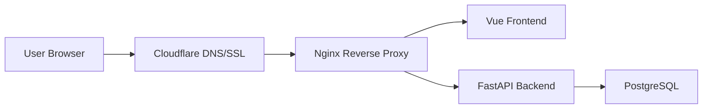

# GeoSerbia

GeoSerbia is a full-stack geolocation guessing web application focused on Serbian locations.

Users are shown a location image and try to guess its position on an interactive map. After each guess, the system calculates the distance from the correct location, assigns points, tracks user performance, and adjusts future location selection through an adaptive difficulty system.

**Live demo:** [https://www.geoserbia.xyz](https://www.geoserbia.xyz)

---

## Overview

GeoSerbia was developed as a Master's thesis project with the goal of building a complete production-ready web application that combines geolocation-based gameplay, user performance tracking, adaptive difficulty, content moderation, and deployment infrastructure.

The application includes:

- user authentication,
- game sessions with multiple rounds,
- distance-based scoring,
- hints,
- daily and monthly leaderboards,
- user statistics,
- user-submitted locations,
- admin moderation,
- image upload validation,
- adaptive difficulty based on user and location performance,
- production deployment on a VPS.

---

## Features

### Gameplay

- Location guessing based on images
- Interactive map-based answer selection
- 5-round game sessions
- Haversine distance calculation
- Distance-based scoring system
- Hint system with score penalty
- Round results and final session summary

### User Features

- User registration, login and logout
- JWT authentication with HTTP-only cookies
- User profile with gameplay statistics
- Daily and monthly leaderboards
- User-submitted location proposals

### Admin Features

- Admin panel for managing locations
- Review of pending user-submitted locations
- Approve or reject submitted locations
- Create, update and delete locations
- Location and user performance statistics

### Adaptive Difficulty

GeoSerbia includes an adaptive difficulty system that tracks:

- user skill level,
- recent user performance,
- average score,
- average distance from correct locations,
- location difficulty,
- global location performance.

Based on these values, the system selects locations that better match the user's current skill level.

### Security and Validation

- JWT stored in HTTP-only cookies
- Protected API endpoints
- Admin-only routes for moderation and management
- Image upload validation
- File size and file type checks
- Server-side permission checks

---

## Tech Stack

### Backend

- Python
- FastAPI
- Tortoise ORM
- PostgreSQL
- Aerich migrations
- Pytest
- REST API architecture

### Frontend

- Vue.js
- JavaScript
- Leaflet
- Axios
- Single Page Application structure

### Infrastructure

- Docker
- Docker Compose
- Nginx reverse proxy
- VPS deployment
- Cloudflare DNS/SSL
- Firewall configuration

---

## Architecture

GeoSerbia follows a client-server architecture.

The frontend is implemented as a Vue.js single-page application. It communicates with the backend through REST API endpoints. The backend handles authentication, game logic, scoring, adaptive difficulty, location moderation, file upload validation and database persistence.

The production version is deployed on a VPS using Docker Compose. Nginx is used as a reverse proxy, while Cloudflare handles DNS and SSL/TLS configuration.



---

## Main Modules

| Path | Description |
|---|---|
| `backend/users/` | Authentication, users and profiles |
| `backend/game/` | Game sessions, rounds, scoring and hints |
| `backend/locations/` | Locations, image uploads and moderation |
| `backend/admin/` | Admin statistics and management |
| `backend/adaptive/` | User skill and location difficulty logic |
| `frontend/` | Vue.js application with game, profile, leaderboard and admin views |
| `deploy/` | Production deployment configuration |

---

## Core Backend Functionality

The backend implements REST endpoints for:

- authentication and authorization,
- user profile statistics,
- starting game sessions,
- submitting round guesses,
- calculating distance and score,
- using hints,
- listing approved locations,
- submitting new locations,
- reviewing pending locations,
- approving and rejecting locations,
- admin location management,
- adaptive statistics.

---

## Scoring System

GeoSerbia uses the Haversine formula to calculate the distance between the user's guess and the correct location.

The score is based on the calculated distance. More accurate guesses receive more points, while distant guesses receive fewer points. Hint usage applies an additional penalty to the final score.

Example scoring logic:

| Distance from correct location | Base score |
|---|---|
| Less than 1 km | 5000 |
| 1–5 km | `4000 - 200 * distance` |
| 5–20 km | `3000 - 50 * distance` |
| 20–100 km | `2000 - 10 * distance` |
| More than 100 km | `max(0, 1000 - 2 * distance)` |

---

## Adaptive Difficulty

The adaptive system is based on two main profiles.

### User Skill Profile

The user skill profile tracks the user's recent performance using values such as:

- average score,
- average distance,
- consistency,
- recent rounds.

### Location Difficulty Profile

The location difficulty profile tracks how difficult each location is based on global user performance:

- average distance for the location,
- average score for the location,
- number of attempts,
- calculated difficulty rating.

When a new game starts, the system compares the user's skill rating with location difficulty ratings and selects suitable locations.

---

## Testing

The project includes automated endpoint-level tests for key backend functionality, including:

- authentication,
- protected endpoints,
- game session flow,
- round submission,
- location management,
- admin moderation,
- validation and edge cases.

Tests are written using `pytest`.

---

## Local Development

### Prerequisites

Make sure you have installed:

- Docker
- Docker Compose
- Git

### Clone the repository

```bash
git clone https://github.com/AleksaMalezic/geo-serbia.git
cd geo-serbia
```

### Start the application

```bash
docker compose up --build
```

Depending on your local configuration, the services will be available on the configured frontend and backend ports.

---

## Environment Variables

The project uses environment variables for database access, authentication secrets and deployment configuration.

Create your local environment files based on the provided example files, if available.

Example variables:

```env
DATABASE_USER=
DATABASE_PASSWORD=
DATABASE_HOST=db
DATABASE_PORT=5432
DATABASE_NAME=

SECRET_KEY=
JWT_ALGORITHM=HS256

FRONTEND_HOST_PORT=
BACKEND_HOST_PORT=
DOMAIN=
```

Never commit real `.env` files, passwords, private keys or tokens.

---

## Production Deployment

The production version is deployed on a VPS using:

- Docker Compose,
- PostgreSQL container,
- FastAPI backend container,
- Vue frontend build,
- Nginx reverse proxy,
- Cloudflare DNS/SSL,
- firewall configuration.

Typical deployment flow:

```bash
git pull
docker compose -f docker-compose.prod.yml --env-file .env up -d --build
docker compose -f docker-compose.prod.yml --env-file .env exec backend aerich upgrade
```
---

## Project Status

GeoSerbia was developed as a Master's thesis project and is currently available as a deployed production demo.

**Live demo:** [https://www.geoserbia.xyz](https://www.geoserbia.xyz)

---

## Author

**Aleksa Malezić**

- LinkedIn: [linkedin.com/in/aleksa-malezic](https://www.linkedin.com/in/aleksa-malezic)
- GitHub: [github.com/AleksaMalezic](https://github.com/AleksaMalezic)

---

## License

This project is intended for portfolio and educational purposes.
